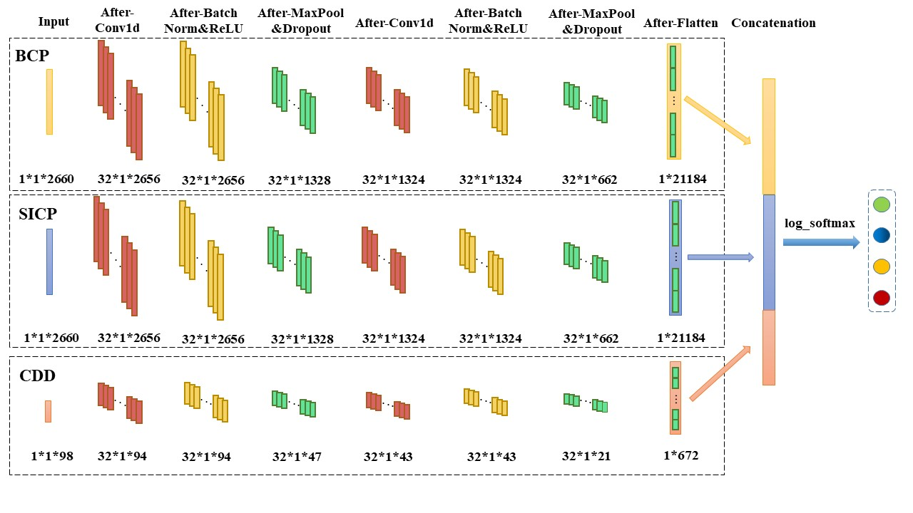

# scHiCyclePred

A deep learning framework for predicting cell cycles from single-cell Hi-C data using multi-scale interaction information.


## Framework
The general framework of scHiCyclePred is as follows：
  
(A) data preparation, scHiCyclePred combines read pair locus mapping file and chromatin interaction pair file to generate a unique chromosome contact matrices for each chromosome in every cell.   
(B) Multiple Feature Sets, this study extracts three feature sets, contact probability distribution versus genomic distance (CDD), bin contact probability (BCP) and small intra-domain contact probability (SICP).   
(C) Fusion-Prediction Model, we develop a deep learning model that combines convolution and feature fusion modules to accurately predict cell cycle phases.   
(D) Results analysis, this study assesses the performance of proposed features and models, and analyzes the feature importance of three feature sets across four cycles using the SHapley Additive exPlanations (SHAP) method.
 
The framework of scHiCyclePred is as follows：
  


## Overview

1. BCP : This folder holds the construction of a predictive model using the BCP feature set alone.

2. CDD : This folder holds the construction of a predictive model using the CDD feature set alone.

3. Construct_fusion_model : This folder holds the construction of a fusion prediction model for the three feature sets.

4. Data : This folder holds the CDD, BCP and SICP feature sets generated in the Feature_sets_extraction phase.

5. Data_Preparation :  This folder holds the code for Data_preparation.

6. Feature_sets_extraction :  This folder holds the code to perform feature-set extraction.

7. Raw_Data : This folder contains the raw data used in this study.

8. SICP : This folder holds the construction of a predictive model using the SICP feature set alone.


## Dependency
Mainly used libraries:  
Python 3.9.15 
torch  1.13.0  
torchvision 0.14.0  
sklearn  
numpy   
See "**requirements.txt"** for all detailed libraries.  
Other developers can use the following command to install the dependencies contained in "**requirements.txt"**:
`pip install -r requirements.txt`  


## Usage

You should run this program in the following order :

1. Data_Preparation : Firstly, you should run `fend_map_coord.py` in folder `Data_Preparation` and then `fend_to_bin.py` by the executing the following command line codes in order:
```
python .\Data_Preparation\fend_map_coord.py
```
```
python .\Data_Preparation\fend_to_bin.py
```
 The purpose of this step is to pre-process the raw data.

2. Feature_sets_extraction : Extract the CDD feature set by running  `Generate_CDD.py` in  folder  `Feature_sets_extraction` , extract the BCP feature set and SICP feature set by running `Generate_BCPandSICP.py`,  normalize the BCP feature set generated by `Generate_BCPandSICP.py` by running `Nor_BCP.py`. The above functions can be accomplished by implementing the following command line codes in order:
```
python .\Feature_sets_extraction\Generate_CDD.py  
```
```
python .\Feature_sets_extraction\Generate_BCPandSICP.py  
```
```
python .\Feature_sets_extraction\Nor_BCP.py
```
3. Construct_fusion_model : Build the fusion prediction model and determine some properties and hyperparameters of the depth model by running the `feature_BCP_SBCP_CDP.py` file in the `Construct_fusion_model/construct_model` folder.
4. Test_fusion_model: Test the fusion prediction model built in the previous step by running the `feature_CDP_SBCP(whole_train_set).py` file in the `Construct_fusion_model/test_model` folder.
5. Construct_CDD_model : Build the CDD single feature set prediction model and determine some properties and hyperparameters of the depth model by running the `feature_CDD.py` file in the `CDD/construct_model` folder.
6. Test_CDD_model: Test the CDD single feature set prediction model built in the previous step by running the `feature_CDD(whole_train_set).py` file in the `CDD/test_model` folder.
7. Construct_BCP_model : Build the BCP single feature set prediction model and determine some properties and hyperparameters of the depth model by running the `feature_BCP.py` file in the `BCP/construct_model` folder.
8. Test_BCP_model: Test the BCP single feature set prediction model built in the previous step by running the `feature_BCP(whole_train_set).py` file in the `BCP/test_model` folder.
9. Construct_SICP_model : Build the SICP single feature set prediction model and determine some properties and hyperparameters of the depth model by running the `feature_SICP.py` file in the `SICP/construct_model` folder.
10. Test_SICP_model: Test the SICP single feature set prediction model built in the previous step by running the `feature_SICP(whole_train_set).py` file in the `SICP/test_model` folder.
